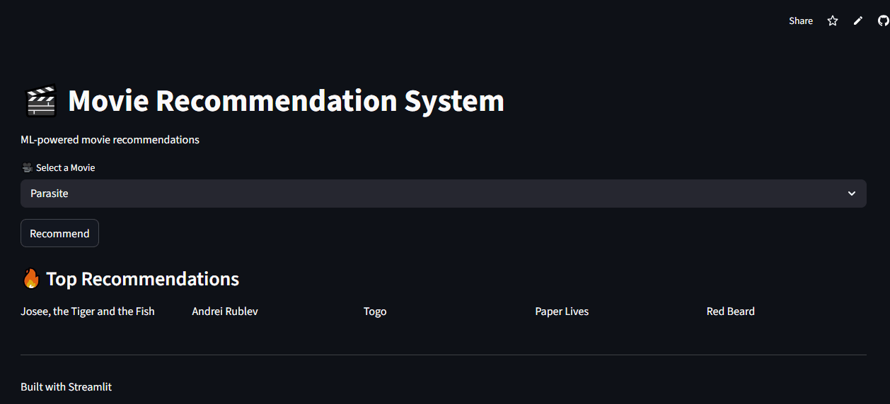

# Movie-Recommendation--System
Movie Recommendation System built using Python, Pandas, Scikit-learn, KMeans, DBSCAN, TF-IDF). suggest similar movies based on clustering and content features.

## 🎥 Demo

## 🌐 Live App
[Try the App](https://movie-recommendation--system-ccimuxddbqjymadufjpv8g.streamlit.app/)

## Model
- TF-IDF Vectorization
- KMeans Clustering

## What it does
- Groups similar movies
- Recommends top 5 similar movies

## Impact
- Helps users discover similar content quickly
- Demonstrates real-world ML pipeline
