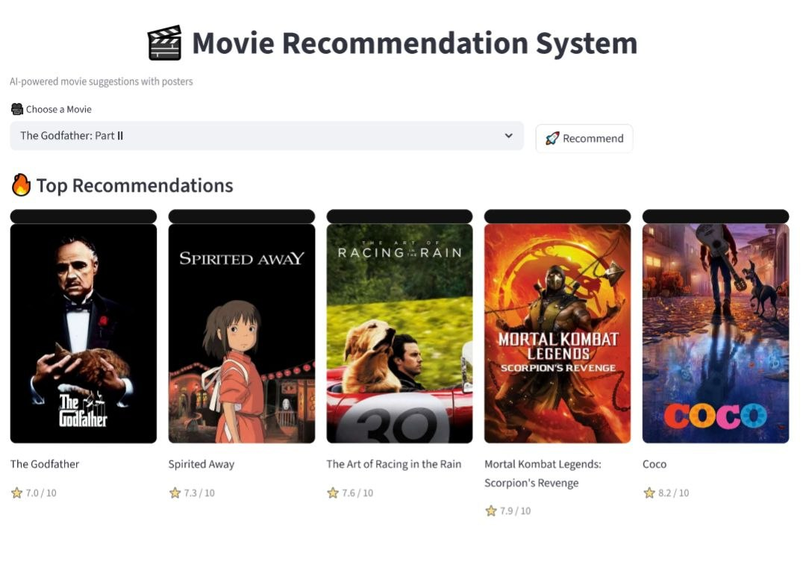

# Content Based Movie Recommendation Engine

A content-based movie recommendation application that uses movie text features, TF-IDF vectorization, and K-Means clustering to group movies with similar content characteristics and recommend relevant movies to users.

## Problem

With a large number of movies available across streaming and entertainment platforms, users can find it difficult to discover movies similar to the ones they already enjoy.
A recommendation system can help users quickly discover relevant content based on movie characteristics.

## Solution

This project implements a content-based recommendation workflow that:
- Processes movie textual information
- Converts text into numerical representations using TF-IDF
- Groups movies using K-Means clustering
- Identifies the cluster associated with a selected movie
- Recommends up to 5 other movies from the same cluster
- Retrieves movie posters dynamically using the TMDB API

## Demo

The interactive Streamlit application allows users to select a movie and generate the top 5 recommendations from its corresponding content cluster.

## App Screenshot

## Features

**Movie Selection** 
Users can select a movie from the available movie dataset through an interactive Streamlit interface.
**Content-Based Recommendations** 
The system recommends movies based on their content characteristics rather than user ratings or collaborative behavior.
**K-Means Clustering** 
Movies are grouped into clusters based on their transformed textual features.
**Top-5 Recommendations** 
The application returns up to five movies from the selected movie's cluster.
**Dynamic Movie Posters** 
Movie posters are retrieved through the TMDB API to provide a more visual recommendation experience.
**Interactive Web Application** 
The complete recommendation workflow is deployed through Streamlit.

## Sample Results

The application generates up to five movie recommendations for the selected movie, along with their posters.
Example workflow:
Selected Movie
      ↓
Identify Movie Cluster
      ↓
Find Movies in Same Cluster
      ↓
Return Top 5 Recommendations

## Tech Stack
- Python
- Pandas
- Scikit-learn
- TF-IDF
- K-Means Clustering
- Streamlit
- Requests
- TMDB API

## Live App
[Try the App](https://movie-recommendation--system-ccimuxddbqjymadufjpv8g.streamlit.app/)

